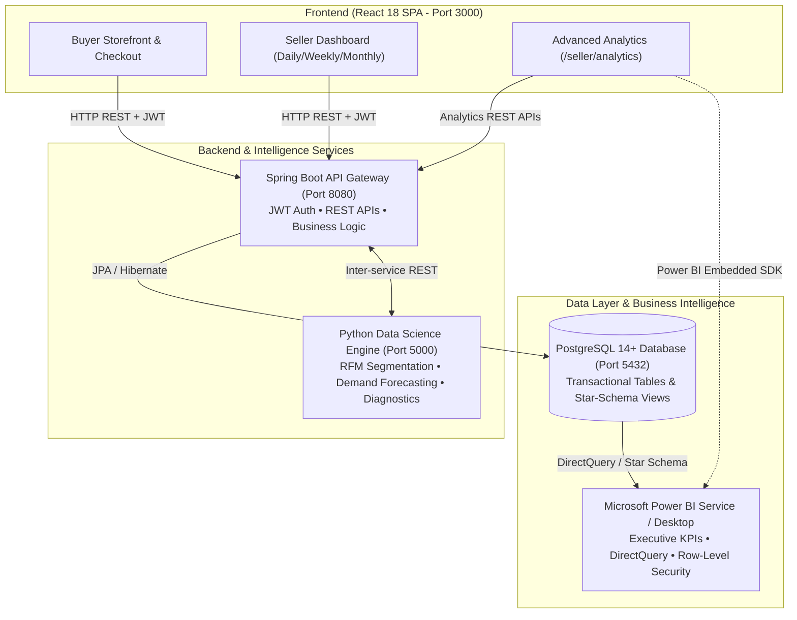

# 🌸 Little Bloom — E-Commerce & Enterprise Business Intelligence Platform

> **A production-ready botanical e-commerce web platform integrating single-page React client architecture, Java Spring Boot microservices, PostgreSQL Star-Schema analytical data warehousing, Python ML predictive forecasting, and Microsoft Power BI Business Intelligence.**

---

## 🏗️ System Architecture



---

## 📊 Business Intelligence & Power BI Integration

The platform features an enterprise-grade Business Intelligence layer accessible at `/seller/analytics` without impacting the existing seller dashboard.

### 1. Multi-Page Power BI Report Pages
1. **Page 1 — Executive Sales Overview**:
   - High-level KPIs: Total Revenue, Completed Orders, Units Sold, Average Order Value (AOV), Active Customers, Repeat Customer %, and Month-over-Month Growth %.
   - Dual-axis interactive time series charts and category revenue share breakdown.
2. **Page 2 — Product Performance Analytics**:
   - Product revenue rankings, unit sales volume, average selling price (ASP), and low-performing SKU alerts.
3. **Page 3 — Customer Intelligence (RFM Analysis)**:
   - Behavioral segmentation computed via Python Pandas (Champions, Loyal Customers, Potential Loyalists, At Risk, Lost Customers).
   - Recency, frequency, and monetary scorecards with customer lifetime value tracking.
4. **Page 4 — Predictive Revenue Forecasting**:
   - 30-day forward demand projections using Linear Regression (60%), Weighted Moving Average (40%), and domain Seasonality multipliers with 95% statistical confidence bounds.
5. **Page 5 — Time-Based Sales Analysis**:
   - Synchronized Daily, Weekly, Monthly, and Yearly sales cycle comparisons.
6. **Page 6 — Power BI Live Embed & Connector**:
   - Direct integration using Microsoft Power BI Embedded SDK, Azure Active Directory Service Principal authentication, and PostgreSQL DirectQuery.

### 2. Multi-Tenant Row-Level Security (RLS)
- Seller data isolation is strictly enforced at both backend and database/DAX levels:
  - **DAX Filter**: `[seller_id] = INT(USERNAME())`
  - **Backend Security**: Spring Boot intercepts all analytical requests, verifies the JWT signature, and enforces data isolation based on the authenticated seller ID.

---

## 🛠️ Technology Stack

| Layer | Technologies Used |
| :--- | :--- |
| **Frontend** | React 18, React Router DOM v6, Recharts, Chart.js, Lucide Icons, Modern CSS3 |
| **Backend API** | Java 17+, Spring Boot 3, Spring Security 6, Spring Data JPA, JWT (jjwt), Maven |
| **Data Science & ML** | Python 3.10+, Flask, Pandas, NumPy, Scikit-Learn, Statsmodels |
| **Data Warehouse** | PostgreSQL 14+ (`FACT_SALES`, `DIM_DATE`, `DIM_PRODUCT`, `DIM_CUSTOMER`, `DIM_SELLER`, `DIM_CATEGORY`) |
| **Business Intelligence** | Microsoft Power BI Desktop & Service, DAX Measures, Power BI Embedded SDK |

---

## 🚀 Local Development Setup & Quickstart

### Prerequisites
- Java JDK 17+ and Maven
- Node.js 18+ and npm
- Python 3.10+
- PostgreSQL 14+ running on port `5432` with database `littlebloom`

### 1. Database Setup
```bash
psql -U postgres -d littlebloom -f database/schema.sql
psql -U postgres -d littlebloom -f database/star_schema_and_views.sql
```

### 2. Start Services
```bash
# Terminal 1: Python Analytics Engine (Port 5000)
cd analytics-server
venv\Scripts\python.exe app.py

# Terminal 2: Spring Boot Backend (Port 8080)
cd backend
mvn spring-boot:run

# Terminal 3: React Frontend (Port 3000)
cd frontend
npm start
```

---

## 📖 Technical Documentation & Guides
- **[Power BI Integration Guide](file:///c:/Users/DHAKSHATHA%20SELVARAJ/OneDrive/Documents/little-bloom/docs/POWER_BI_INTEGRATION_GUIDE.md)**: Full DAX formula library, Star-Schema DDL, RLS security setup, and Excel validation workflows.
- **[Database Migrations README](file:///c:/Users/DHAKSHATHA%20SELVARAJ/OneDrive/Documents/little-bloom/database/migrations/README.md)**: Schema history and migration rules.

---

## 🔒 Security & Data Integrity
- Passwords hashed with BCrypt.
- Stateless authentication with signed JSON Web Tokens (JWT).
- Row-Level Security (RLS) guarantees complete multi-tenant seller isolation.
- Sensitive credentials, secrets, and database passwords are restricted to backend environment variables.
