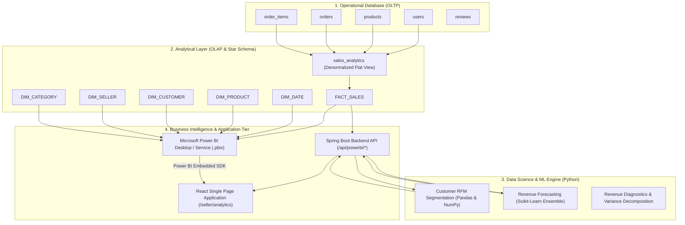

# 📊 Microsoft Power BI & Business Intelligence Integration Guide
## Little Bloom E-Commerce Enterprise Data Analytics Platform

---

## 1. System Architecture & End-to-End Data Pipeline



---

## 2. PostgreSQL Star Schema Architecture

The analytical layer connects to the PostgreSQL operational database (`littlebloom`) via the following views created in `database/star_schema_and_views.sql`:

### 2.1. Fact Table: `FACT_SALES`
| Column | Data Type | Description | Reference |
| :--- | :--- | :--- | :--- |
| `sales_key` | BIGINT | Unique primary key for each sales line item | `order_items.id` |
| `order_id` | BIGINT | Parent transaction order identifier | `orders.id` |
| `date_key` | INT | Date dimension key in `YYYYMMDD` format | `DIM_DATE.date_key` |
| `product_id` | BIGINT | Sold product foreign key | `DIM_PRODUCT.product_id` |
| `seller_id` | BIGINT | Seller entity foreign key | `DIM_SELLER.seller_id` |
| `buyer_id` | BIGINT | Purchasing customer foreign key | `DIM_CUSTOMER.buyer_id` |
| `quantity` | INT | Quantity of botanical items sold | Number of units |
| `unit_price` | DECIMAL(10,2) | Unit sale price in INR (₹) | Unit rate |
| `total_price` | DECIMAL(10,2) | Total revenue ($quantity \times unit\_price$) | Line item revenue |
| `payment_method` | VARCHAR(50) | Payment mode (`COD`, `ONLINE`) | Order mode |
| `order_status` | VARCHAR(50) | Lifecycle state (`PENDING`, `DELIVERED`, etc.) | Excludes `CANCELLED` |
| `delivered_at` | TIMESTAMP | Accurate timestamp when order was delivered | Delivery date |
| `transaction_timestamp` | TIMESTAMP | Full order creation date & time | Time record |

### 2.2. Dimension Tables
1. **`DIM_DATE`**: Generated daily date series with `date_key`, `full_date`, `day_of_month`, `day_name`, `day_of_week`, `week_of_year`, `month_number`, `month_name`, `quarter`, `year`, and `is_weekend`.
2. **`DIM_PRODUCT`**: `product_id`, `product_name`, `category_name`, `unit_price`, `stock_quantity`, `product_size`, `seller_id`.
3. **`DIM_CUSTOMER`**: `buyer_id`, `customer_name`, `customer_email`, `buyer_code`, `city`, `state`, `postal_code`, `phone`, `registration_date`.
4. **`DIM_SELLER`**: `seller_id`, `seller_name`, `seller_email`, `seller_code`, `city`, `state`, `phone`, `registration_date`.
5. **`DIM_CATEGORY`**: `category_name`, `total_products`, `avg_product_price`.

---

## 3. Power BI DAX Measures Reference Library

All KPI metrics and time-intelligence calculations in Power BI should use explicit DAX measures:

### Core Financial & Operational Measures
```dax
-- 1. Total Revenue
Total Revenue = 
SUM(FACT_SALES[total_price])

-- 2. Total Orders
Total Orders = 
DISTINCTCOUNT(FACT_SALES[order_id])

-- 3. Units Sold
Units Sold = 
SUM(FACT_SALES[quantity])

-- 4. Average Order Value (AOV)
Average Order Value = 
DIVIDE([Total Revenue], [Total Orders], 0)

-- 5. Active Customers
Active Customers = 
DISTINCTCOUNT(FACT_SALES[buyer_id])

-- 6. Repeat Customers
Repeat Customers = 
CALCULATE(
    DISTINCTCOUNT(FACT_SALES[buyer_id]),
    FILTER(
        VALUES(FACT_SALES[buyer_id]),
        CALCULATE(DISTINCTCOUNT(FACT_SALES[order_id])) > 1
    )
)

-- 7. Repeat Customer Percentage
Repeat Customer % = 
DIVIDE([Repeat Customers], [Active Customers], 0)
```

### Time Intelligence Measures
```dax
-- 8. Previous Month Revenue
Previous Month Revenue = 
CALCULATE(
    [Total Revenue],
    DATEADD(DIM_DATE[full_date], -1, MONTH)
)

-- 9. Month-over-Month (MoM) Revenue Growth %
Revenue Growth % = 
VAR PrevMonth = [Previous Month Revenue]
RETURN
DIVIDE([Total Revenue] - PrevMonth, PrevMonth, 0)

-- 10. Year-to-Date (YTD) Revenue
YTD Revenue = 
TOTALYTD([Total Revenue], DIM_DATE[full_date])

-- 11. Same Period Last Year (YoY)
Revenue SPLY = 
CALCULATE(
    [Total Revenue],
    SAMEPERIODLASTYEAR(DIM_DATE[full_date])
)
```

---

## 4. Customer RFM Segmentation Methodology

Customer value and behavior are categorized using three primary quantitative dimensions:

$$\text{RFM Score} = (\text{Recency Score}) + (\text{Frequency Score}) + (\text{Monetary Score})$$

### Segment Archetypes & Business Actions
| Segment | Criteria | Strategic Action |
| :--- | :--- | :--- |
| 🏆 **Champions** | $Frequency \ge 3 \text{ orders}$, $Recency \le 30 \text{ days}$ | VIP loyalty rewards, exclusive botanical pre-orders |
| 💎 **Loyal Customers** | $Frequency \ge 2 \text{ orders}$, $Recency \le 60 \text{ days}$ | Upsell premium planters & bundled plant sets |
| 🌱 **Potential Loyalists** | $Frequency = 1 \text{ order}$, $Recency \le 30 \text{ days}$ | Onboarding welcome offers, care guide cross-sells |
| ⚠️ **At Risk** | $Frequency \ge 2 \text{ orders}$, $Recency > 60 \text{ days}$ | Win-back discount coupons, personalized re-engagement |
| 💤 **Lost Customers** | $Recency > 90 \text{ days}$ | Seasonal festival reactivation campaigns |

---

## 5. Predictive Revenue Forecasting Methodology

The Little Bloom Python Analytics Service uses a three-tier ensemble model:

1. **Linear Regression Trend ($60\%$ Weight)**:
   $$Y_{\text{trend}} = mX + c$$
   Captures underlying structural business growth and momentum.

2. **Weighted Moving Average ($40\%$ Weight)**:
   $$Y_{\text{wma}} = \frac{3 \cdot Y_{t} + 2 \cdot Y_{t-1} + 1 \cdot Y_{t-2}}{6}$$
   Smooths short-term day-to-day volatility.

3. **Seasonality Multipliers**:
   $$Y_{\text{final}} = (0.60 \cdot Y_{\text{trend}} + 0.40 \cdot Y_{\text{wma}}) \times S_{\text{month}}$$
   Applies domain coefficients (e.g., Mother's Day, Valentine's, Diwali, festive peaks).

4. **Confidence Intervals ($95\%$ bounds)**:
   $$\text{Upper Bound} = Y_{\text{final}} + 1.96 \cdot \sigma$$
   $$\text{Lower Bound} = \max(0, Y_{\text{final}} - 1.96 \cdot \sigma)$$

---

## 6. Row-Level Security (RLS) & Multi-Tenant Isolation

To ensure that each seller **strictly views only their own commercial data**:

1. **Power BI RLS Role Definition**:
   Create a role called `SellerRLS` in Power BI Desktop under **Modeling ➔ Manage Roles**:
   ```dax
   -- Table: FACT_SALES or sales_analytics
   [seller_id] = INT(USERNAME())
   ```

2. **Backend Authentication Enforcement**:
   - In Spring Boot [`PowerBIController.java`](file:///c:/Users/DHAKSHATHA%20SELVARAJ/OneDrive/Documents/little-bloom/backend/src/main/java/com/littlebloom/controller/PowerBIController.java), the seller ID is extracted directly from the verified JWT token (`CustomUserDetails.getUserId()`).
   - The token cannot be forged or tampered with by the client.
   - When generating Power BI Embed Tokens, the `EffectiveIdentity` is set to:
     ```json
     {
       "username": "1",
       "roles": ["SellerRLS"],
       "datasets": ["<Dataset-GUID>"]
     }
     ```

---

## 7. Excel Analyst Validation Workflow

To validate calculations between database records, Python calculations, and Power BI output:

1. **Step 1: Export PostgreSQL Sales Dataset**:
   ```sql
   \copy (SELECT * FROM sales_analytics) TO 'sales_validation.csv' WITH CSV HEADER;
   ```

2. **Step 2: Excel Pivot Table Validation**:
   - Open `sales_validation.csv` in Microsoft Excel.
   - Insert ➔ **Pivot Table**.
   - Rows: `order_date` (grouped by Year, Month).
   - Values: `Sum of total_price` ($\text{Revenue}$), `Count of order_id` ($\text{Orders}$), `Sum of quantity` ($\text{Units}$).

3. **Step 3: Compare Cross-Platform Totals**:
   - Compare Excel Pivot Table totals with Python `/analytics/dashboard` totals.
   - Compare with Power BI `[Total Revenue]` DAX output.
   - Verify that all three systems match to $0.00$ discrepancy.

---

## 8. Environment Variables & Production Configuration

### Backend (`application.properties`):
```properties
# Microsoft Power BI Embedded Credentials (Keep confidential)
powerbi.tenant.id=00000000-0000-0000-0000-000000000000
powerbi.client.id=00000000-0000-0000-0000-000000000000
powerbi.client.secret=YourAzureAppSecretKeyHere
powerbi.group.id=00000000-0000-0000-0000-000000000000
powerbi.report.id=00000000-0000-0000-0000-000000000000
powerbi.embed.url=https://app.powerbi.com/reportEmbed?reportId=...
```

### Frontend (`.env`):
```env
# Power BI Client Settings (Non-sensitive report identifiers)
REACT_APP_POWERBI_REPORT_ID=00000000-0000-0000-0000-000000000000
REACT_APP_POWERBI_GROUP_ID=00000000-0000-0000-0000-000000000000
REACT_APP_POWERBI_EMBED_URL=https://app.powerbi.com/reportEmbed?reportId=...
```
